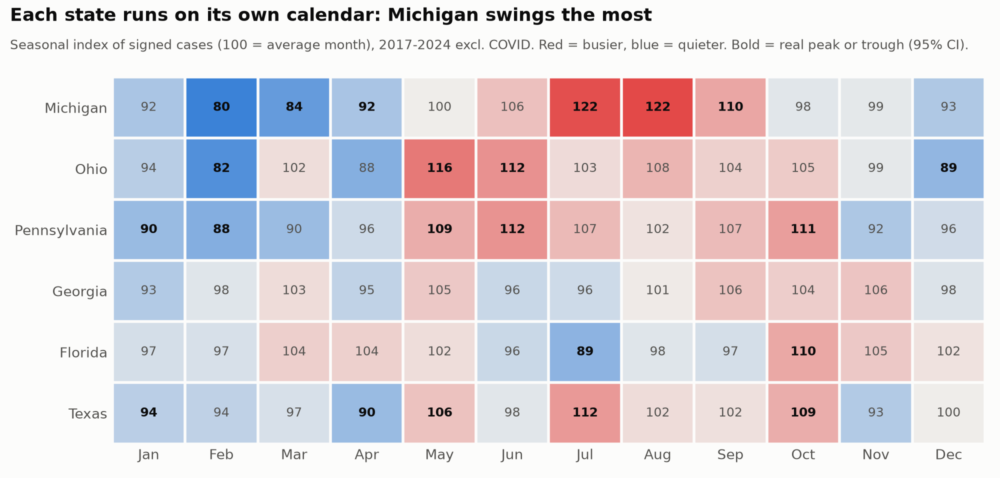
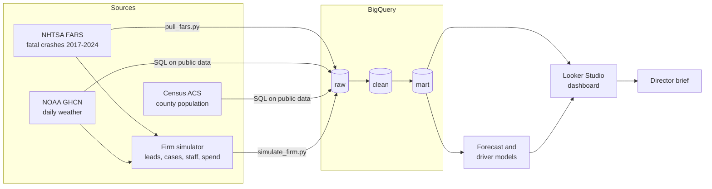

# PI Case Intake Forecasting & Growth Analytics

**Forecasting when, where and what kind of personal injury cases arrive across a six-state law firm, and turning that forecast into staffing, marketing and profit decisions.**

## The business problem

Our firm runs 12 offices across Michigan, Ohio, Pennsylvania, Georgia, Florida and Texas. Today we plan staffing and marketing as if every month were the same. Case intake is seasonal and differs by state. The analysis confirmed some starting hypotheses and overturned others:

- **Confirmed:** Florida runs opposite to the northern offices, busiest in fall and winter and quietest in summer.
- **Confirmed:** Motorcycle cases are by far the most seasonal case type, concentrated in summer.
- **Overturned:** "Michigan and Ohio auto cases rise with winter ice." Fatal-crash data peaks in summer instead. Winter crashes are more frequent but less often fatal, so this is tested next with state injury-crash data.

The result: intake teams are stretched in peak months and idle in slow ones, ad budgets run flat, and office managers are judged on raw case counts that mostly reflect weather and traffic.

## Decisions this project supports

| Decision | What leadership gets |
| --- | --- |
| Staffing | Forecast signed cases per office per month, with a likely range |
| Marketing | The months and markets where each ad dollar signs the most cases |
| Revenue planning | Expected fee revenue over the next 24 months |
| Office performance | A market-share scorecard: did the market shrink, or did we lose ground? |
| Hiring & retention | Which roles we lose people from, in which months, and when to hire |

## Approach

```
Fee revenue = Market demand × Capture rate × Value per case
```

- **Market demand.** Injury-crash activity in our counties, from public NHTSA data. It is shaped by season, weather and population, so we forecast it rather than manage it.
- **Capture rate.** The share of that demand our firm signs. Marketing, intake speed and staffing move it.
- **Value per case.** Settlement × fee, timed by how long cases take to pay.

Separating demand from capture is what makes office performance fair to judge, and it is what turns the forecast into growth decisions.

## Latest findings



Each state runs on its own intake calendar, Florida runs opposite to the firm (a case for a shared intake team), and intake reaches capacity in the busy season, slowing callbacks.
Full findings, dollar values and recommendations: [`reports/seasonality_findings.md`](reports/seasonality_findings.md).

## Architecture



| Layer | What it holds | Built by |
| --- | --- | --- |
| raw | Data exactly as loaded: public sources plus the simulated firm systems | `pipelines/pull_fars.py`, `sql/0*.sql`, `pipelines/simulate_firm.py` |
| clean | Tidy, keyed, flagged (COVID, Michigan and Florida reforms, analysis window) | `sql/1*.sql` |
| mart | One table per business question: forecasting, office scorecard, case economics, workforce | `sql/2*.sql` |

Full table and column reference: [`reports/data_dictionary.md`](reports/data_dictionary.md).

## Data

- **Real, public:** NHTSA FARS crash data, NOAA weather (GHCN-Daily), U.S. Census ACS.
- **Simulated firm data:** leads, cases, payments, marketing spend, staffing and hours. These are generated on top of the real crash and weather patterns using documented rates (see [`reports/assumptions.md`](reports/assumptions.md)).
- **Plant and recover:** the simulation plants known effects, and automated tests must recover them from the warehouse, including a placebo test that must find nothing. This proves the method before it is trusted on real firm data. Latest results: [`reports/planted_effects_results.md`](reports/planted_effects_results.md).

## Trust and quality

| Control | How |
| --- | --- |
| Reconciliation | Leads and fees tie from raw to mart to the dollar (`sql/checks/mart_checks.sql`) |
| Completeness | Every office x case type x month present; no gaps in demand or weather inputs |
| Method validation | Planted effects recovered within tolerance; placebo finds no effect (`tests/`) |
| Domain correctness | Case costs are charged only on lost cases (won cases reimburse costs from the settlement); profit is reported as contribution margin, before overhead |
| Reproducibility | Fixed random seed; every table rebuilt from code; decisions dated in [`reports/build_log.md`](reports/build_log.md) |

## How to reproduce

```powershell
python pipelines/pull_fars.py                   # 1. public crash data -> raw
#  run sql/01 and sql/02 in BigQuery            # 2. weather and population -> raw
python pipelines/simulate_firm.py               # 3. simulated firm -> raw
python pipelines/run_sql.py                     # 4. build clean and mart layers
python pipelines/run_sql.py --checks            # 5. reconciliation and completeness checks
python tests/test_planted_effects.py            # 6. plant-and-recover validation
python pipelines/make_data_dictionary.py        # 7. refresh the data dictionary
```

## Stack

Python · BigQuery · SQL · statsmodels · LightGBM · Looker Studio

## Repo structure

```
data/raw/          public downloads (not committed)
data/simulated/    generated firm tables
pipelines/         data pulls, simulation, loading
sql/               BigQuery SQL: raw, clean and mart layers, plus checks
tests/             plant-and-recover validation
notebooks/         seasonality, models, validation
reports/           scope, assumptions, data dictionary, build log, director brief, model card
```

## Status

- [x] Environment, BigQuery and GitHub setup
- [x] Scope and assumptions
- [x] Public data pull (FARS crashes, NOAA weather, Census population)
- [x] Firm simulation with planted effects
- [x] Warehouse layers (clean, mart) with reconciliation checks
- [x] Data dictionary and plant-and-recover tests
- [x] Seasonality analysis ([findings](reports/seasonality_findings.md))
- [x] 12-month forecast, backtested against baselines ([report](reports/forecast_report.md))
- [x] Dashboard data layer (`mart.dash_*` views) and [build guide](reports/dashboard_guide.md)
- [ ] Looker Studio dashboard (published)
- [ ] Director brief
