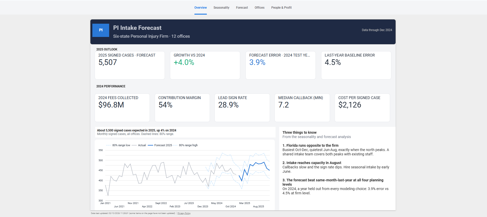
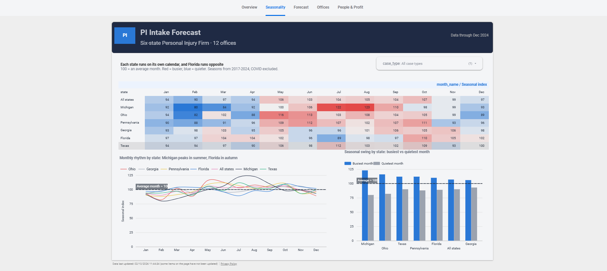
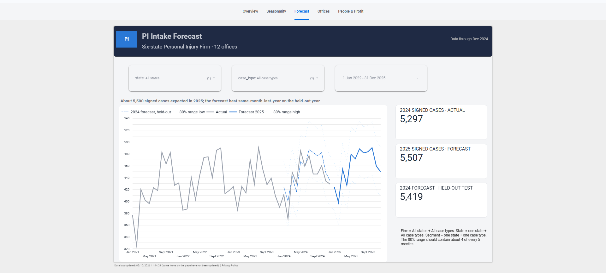
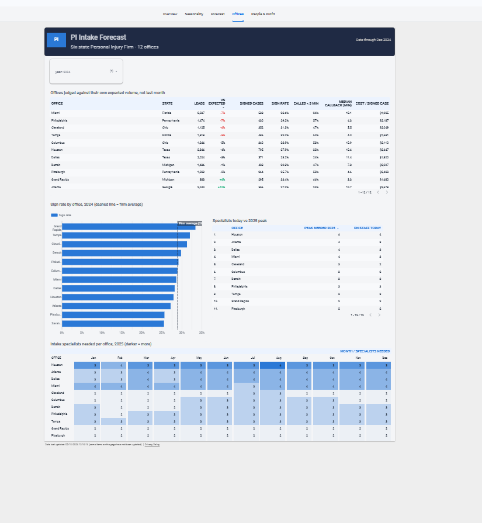
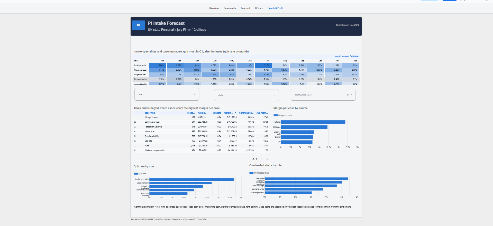

# PI Case Intake Forecasting & Growth Analytics

**Forecasting when, where and what kind of personal injury cases arrive across a six-state law firm, and turning that forecast into staffing, marketing and profit decisions.**

[**View the Live Looker Studio Dashboard**](https://datastudio.google.com/reporting/d4b3d152-2c36-40db-87b3-82bee2833d20)

---

## The Business Problem

Our firm runs 12 offices across Michigan, Ohio, Pennsylvania, Georgia, Florida and Texas.

Staffing and marketing cannot be planned effectively if every month is treated the same. Case intake is seasonal, differs by state, and varies by case type.

This project analyzes those patterns and connects intake forecasting to operational decisions around staffing, marketing, office performance and case economics.

The analysis confirmed some starting hypotheses and overturned others:

- **Confirmed:** Florida runs opposite to the northern offices, busiest in fall and winter and quietest in summer.
- **Confirmed:** Motorcycle cases are by far the most seasonal case type, concentrated in summer.
- **Overturned:** "Michigan and Ohio auto cases rise with winter ice." Fatal-crash data peaks in summer instead. Winter crashes are more frequent but less often fatal, so this is identified as an area for follow-up with state injury-crash data.

The result is a planning framework that helps identify peak intake periods, slower periods, office-level demand patterns, staffing pressure and opportunities to align marketing with demand.

---

## Decisions This Project Supports

| Decision | What leadership gets |
| --- | --- |
| **Staffing** | Forecast signed cases per office per month, with a likely range |
| **Marketing** | The months and markets where each ad dollar signs the most cases |
| **Revenue planning** | Expected fee revenue over the next 24 months |
| **Office performance** | A market-share scorecard: did the market shrink, or did we lose ground? |
| **Hiring & retention** | Which roles experience staffing pressure, in which months, and when to hire |

---

## Dashboard

The final dashboard brings the analysis together across five business-facing views.

### 1. Overview

Firm-wide intake, signed cases, revenue and operating indicators.



### 2. Seasonality

State and case-type seasonality showing when demand changes throughout the year.



### 3. Forecast

Forward-looking intake and revenue planning based on the forecasting models.



### 4. Offices

Office-level demand, capture and market performance across the six-state footprint.



### 5. People & Profit

Staffing capacity, workload, case economics and contribution margin.



---

## Approach

The project separates three drivers of fee revenue:

```text
Fee revenue = Market demand × Capture rate × Value per case
Market demand
Injury-crash activity in the firm's counties, using public NHTSA data as the seasonal demand signal.
Demand is shaped by season, weather and population, so the model forecasts it rather than treating every month as equal.
Capture rate
The share of market demand that the firm signs.
Marketing, intake speed and staffing are modeled as factors that can influence capture.
Value per case
Settlement value multiplied by the applicable contingency fee, with the timing of payment incorporated into the case economics.
Separating demand from capture makes office performance more meaningful to evaluate and connects the forecast to growth decisions.
Key Findings
Florida follows a different seasonal pattern
Florida runs opposite to the northern offices, with stronger intake in fall and winter and lower activity during summer.
This creates an opportunity to think about intake capacity across markets rather than staffing every office around the same seasonal calendar.
Motorcycle cases are highly seasonal
Motorcycle cases show the strongest seasonality among the modeled case types, with activity concentrated in the summer months.
One winter assumption was overturned
The initial assumption was that Michigan and Ohio auto cases would rise with winter ice.
The FARS fatal-crash signal did not support that assumption. Fatal crashes peaked during summer instead.
This does not establish that total injury crashes follow the same pattern. Winter injury-crash data is identified as the next data source needed to test the hypothesis properly.
 
Detailed findings:
[**Seasonality Findings**](reports/seasonality_findings.md)
Data
The project combines real public data with a reproducible simulated firm environment.
Real public data
- NHTSA FARS — fatal crash data used as the seasonal demand signal
- NOAA GHCN-Daily — daily weather data
- U.S. Census ACS — county population data
Simulated firm data
The firm-level systems are simulated using documented assumptions:
- Leads
- Cases
- Payments
- Marketing spend
- Staffing
- Staff hours
- Case types
- Settlement values
- Case costs
The simulation is built on top of real public crash, weather and population patterns.
All simulated values are documented in the assumptions log.

[**View Assumptions**](reports/assumptions.md)
Important Data Limitation
FARS covers fatal crashes only.
It is therefore used as a seasonal and geographic demand signal rather than as a direct measure of total injury volume.
The absolute level of injury demand is an estimate. The seasonal shape and trend are the more reliable components of the signal.
Premises liability, dog bite and workers' compensation cases do not have a direct public crash signal, so their seasonality is simulated and explicitly documented.
The firm results describe a simulated firm. The methodology and analytical framework are intended to transfer to real firm data.
Architecture
#chatgpt-mermaid-_r_137_{font-family:-apple-system-body,ui-sans-serif,-apple-system,system-ui,"Segoe UI",Helvetica,"Apple Color Emoji",Arial,sans-serif,"Segoe UI Emoji","Segoe UI Symbol";font-size:16px;fill:rgb(237, 237, 237);}@keyframes edge-animation-frame{from{stroke-dashoffset:0;}}@keyframes dash{to{stroke-dashoffset:0;}}#chatgpt-mermaid-_r_137_ .edge-animation-slow{stroke-dasharray:9,5!important;stroke-dashoffset:900;animation:dash 50s linear infinite;stroke-linecap:round;}#chatgpt-mermaid-_r_137_ .edge-animation-fast{stroke-dasharray:9,5!important;stroke-dashoffset:900;animation:dash 20s linear infinite;stroke-linecap:round;}#chatgpt-mermaid-_r_137_ .error-icon{fill:rgb(27, 27, 27);}#chatgpt-mermaid-_r_137_ .error-text{fill:rgb(237, 237, 237);stroke:rgb(237, 237, 237);}#chatgpt-mermaid-_r_137_ .edge-thickness-normal{stroke-width:1px;}#chatgpt-mermaid-_r_137_ .edge-thickness-thick{stroke-width:3.5px;}#chatgpt-mermaid-_r_137_ .edge-pattern-solid{stroke-dasharray:0;}#chatgpt-mermaid-_r_137_ .edge-thickness-invisible{stroke-width:0;fill:none;}#chatgpt-mermaid-_r_137_ .edge-pattern-dashed{stroke-dasharray:3;}#chatgpt-mermaid-_r_137_ .edge-pattern-dotted{stroke-dasharray:2;}#chatgpt-mermaid-_r_137_ .marker{fill:rgb(175, 175, 175);stroke:rgb(175, 175, 175);}#chatgpt-mermaid-_r_137_ .marker.cross{stroke:rgb(175, 175, 175);}#chatgpt-mermaid-_r_137_ svg{font-family:-apple-system-body,ui-sans-serif,-apple-system,system-ui,"Segoe UI",Helvetica,"Apple Color Emoji",Arial,sans-serif,"Segoe UI Emoji","Segoe UI Symbol";font-size:16px;}#chatgpt-mermaid-_r_137_ p{margin:0;}#chatgpt-mermaid-_r_137_ .label{font-family:-apple-system-body,ui-sans-serif,-apple-system,system-ui,"Segoe UI",Helvetica,"Apple Color Emoji",Arial,sans-serif,"Segoe UI Emoji","Segoe UI Symbol";color:rgb(237, 237, 237);}#chatgpt-mermaid-_r_137_ .cluster-label text{fill:rgb(237, 237, 237);}#chatgpt-mermaid-_r_137_ .cluster-label span{color:rgb(237, 237, 237);}#chatgpt-mermaid-_r_137_ .cluster-label span p{background-color:transparent;}#chatgpt-mermaid-_r_137_ .label text,#chatgpt-mermaid-_r_137_ span{fill:rgb(237, 237, 237);color:rgb(237, 237, 237);}#chatgpt-mermaid-_r_137_ .node rect,#chatgpt-mermaid-_r_137_ .node circle,#chatgpt-mermaid-_r_137_ .node ellipse,#chatgpt-mermaid-_r_137_ .node polygon,#chatgpt-mermaid-_r_137_ .node path{fill:rgb(9, 23, 44);stroke:rgb(31, 78, 148);stroke-width:1px;}#chatgpt-mermaid-_r_137_ .rough-node .label text,#chatgpt-mermaid-_r_137_ .node .label text,#chatgpt-mermaid-_r_137_ .image-shape .label,#chatgpt-mermaid-_r_137_ .icon-shape .label{text-anchor:middle;}#chatgpt-mermaid-_r_137_ .node .katex path{fill:#000;stroke:#000;stroke-width:1px;}#chatgpt-mermaid-_r_137_ .rough-node .label,#chatgpt-mermaid-_r_137_ .node .label,#chatgpt-mermaid-_r_137_ .image-shape .label,#chatgpt-mermaid-_r_137_ .icon-shape .label{text-align:center;}#chatgpt-mermaid-_r_137_ .node.clickable{cursor:pointer;}#chatgpt-mermaid-_r_137_ .root .anchor path{fill:rgb(175, 175, 175)!important;stroke-width:0;stroke:rgb(175, 175, 175);}#chatgpt-mermaid-_r_137_ .arrowheadPath{fill:rgb(175, 175, 175);}#chatgpt-mermaid-_r_137_ .edgePath .path{stroke:rgb(175, 175, 175);stroke-width:1px;}#chatgpt-mermaid-_r_137_ .flowchart-link{stroke:rgb(175, 175, 175);fill:none;}#chatgpt-mermaid-_r_137_ .edgeLabel{background-color:rgb(0, 0, 0);text-align:center;}#chatgpt-mermaid-_r_137_ .edgeLabel p{background-color:rgb(0, 0, 0);}#chatgpt-mermaid-_r_137_ .edgeLabel rect{opacity:0.5;background-color:rgb(0, 0, 0);fill:rgb(0, 0, 0);}#chatgpt-mermaid-_r_137_ .labelBkg{background-color:rgba(0, 0, 0, 0.5);}#chatgpt-mermaid-_r_137_ .cluster rect{fill:rgb(27, 27, 27);stroke:rgba(255, 255, 255, 0.15);stroke-width:1px;}#chatgpt-mermaid-_r_137_ .cluster text{fill:rgb(237, 237, 237);}#chatgpt-mermaid-_r_137_ .cluster span{color:rgb(237, 237, 237);}#chatgpt-mermaid-_r_137_ div.mermaidTooltip{position:absolute;text-align:center;max-width:200px;padding:2px;font-family:-apple-system-body,ui-sans-serif,-apple-system,system-ui,"Segoe UI",Helvetica,"Apple Color Emoji",Arial,sans-serif,"Segoe UI Emoji","Segoe UI Symbol";font-size:12px;background:rgb(27, 27, 27);border:1px solid rgba(255, 255, 255, 0.15);border-radius:2px;pointer-events:none;z-index:100;}#chatgpt-mermaid-_r_137_ .flowchartTitleText{text-anchor:middle;font-size:18px;fill:rgb(237, 237, 237);}#chatgpt-mermaid-_r_137_ rect.text{fill:none;stroke-width:0;}#chatgpt-mermaid-_r_137_ .icon-shape,#chatgpt-mermaid-_r_137_ .image-shape{background-color:rgb(0, 0, 0);text-align:center;}#chatgpt-mermaid-_r_137_ .icon-shape p,#chatgpt-mermaid-_r_137_ .image-shape p{background-color:rgb(0, 0, 0);padding:2px;}#chatgpt-mermaid-_r_137_ .icon-shape .label rect,#chatgpt-mermaid-_r_137_ .image-shape .label rect{opacity:0.5;background-color:rgb(0, 0, 0);fill:rgb(0, 0, 0);}#chatgpt-mermaid-_r_137_ .label-icon{display:inline-block;height:1em;overflow:visible;vertical-align:-0.125em;}#chatgpt-mermaid-_r_137_ .node .label-icon path{fill:currentColor;stroke:revert;stroke-width:revert;}#chatgpt-mermaid-_r_137_ .node .neo-node{stroke:rgb(31, 78, 148);}#chatgpt-mermaid-_r_137_ [data-look="neo"].node rect,#chatgpt-mermaid-_r_137_ [data-look="neo"].cluster rect,#chatgpt-mermaid-_r_137_ [data-look="neo"].node polygon{stroke:url(#chatgpt-mermaid-_r_137_-gradient);filter:drop-shadow( 1px 2px 2px rgba(185,185,185,1));}#chatgpt-mermaid-_r_137_ [data-look="neo"].swimlane.cluster rect{filter:none;}#chatgpt-mermaid-_r_137_ [data-look="neo"].node path{stroke:url(#chatgpt-mermaid-_r_137_-gradient);stroke-width:1px;}#chatgpt-mermaid-_r_137_ [data-look="neo"].node .outer-path{filter:drop-shadow( 1px 2px 2px rgba(185,185,185,1));}#chatgpt-mermaid-_r_137_ [data-look="neo"].node .neo-line path{stroke:rgb(31, 78, 148);filter:none;}#chatgpt-mermaid-_r_137_ [data-look="neo"].node circle{stroke:url(#chatgpt-mermaid-_r_137_-gradient);filter:drop-shadow( 1px 2px 2px rgba(185,185,185,1));}#chatgpt-mermaid-_r_137_ [data-look="neo"].node circle .state-start{fill:#000000;}#chatgpt-mermaid-_r_137_ [data-look="neo"].icon-shape .icon{fill:url(#chatgpt-mermaid-_r_137_-gradient);filter:drop-shadow( 1px 2px 2px rgba(185,185,185,1));}#chatgpt-mermaid-_r_137_ [data-look="neo"].icon-shape .icon-neo path{stroke:url(#chatgpt-mermaid-_r_137_-gradient);filter:drop-shadow( 1px 2px 2px rgba(185,185,185,1));}#chatgpt-mermaid-_r_137_ .node text{font-size:14px;font-weight:600;letter-spacing:normal;fill:rgb(153, 206, 255);}#chatgpt-mermaid-_r_137_ .edgeLabels text{font-size:13px;font-weight:600;letter-spacing:-0.08px;fill:rgb(153, 206, 255);}#chatgpt-mermaid-_r_137_ .node tspan[font-weight="normal"],#chatgpt-mermaid-_r_137_ .edgeLabels tspan[font-weight="normal"]{font-weight:600;}#chatgpt-mermaid-_r_137_ .edgeLabel .label rect{opacity:1;rx:13px;ry:13px;fill:rgb(0, 14, 26);stroke:rgb(26, 62, 95);stroke-width:1px;}#chatgpt-mermaid-_r_137_ .node rect,#chatgpt-mermaid-_r_137_ .node circle,#chatgpt-mermaid-_r_137_ .node ellipse,#chatgpt-mermaid-_r_137_ .node polygon,#chatgpt-mermaid-_r_137_ .node path{fill:rgb(0, 40, 77);stroke:rgba(255, 255, 255, 0.1);stroke-width:1px;}#chatgpt-mermaid-_r_137_ .node rect{rx:16px;ry:16px;}#chatgpt-mermaid-_r_137_ .node.mermaid-decision .label-container{fill:rgb(0, 14, 26);stroke:rgb(26, 62, 95);stroke-dasharray:2,2;}#chatgpt-mermaid-_r_137_ .edgePaths .flowchart-link{stroke:rgb(175, 175, 175);stroke-width:1px;stroke-linecap:round;stroke-linejoin:round;}#chatgpt-mermaid-_r_137_ .marker{fill:rgb(175, 175, 175);stroke:rgb(175, 175, 175);}#chatgpt-mermaid-_r_137_ :root{--mermaid-font-family:-apple-system-body,ui-sans-serif,-apple-system,system-ui,"Segoe UI",Helvetica,"Apple Color Emoji",Arial,sans-serif,"Segoe UI Emoji","Segoe UI Symbol";}BigQuerySourcesrawcleanmartNHTSA FARSfatal crashes 2017-2024NOAA GHCNdaily weatherCensus ACScounty populationFirm simulatorleads, cases, staff, spendForecast anddriver modelsLooker StudiodashboardDirector briefpull_fars.pySQL on public dataSQL on public datasimulate_firm.py


Warehouse Layers
Layer	What it holds	Built by
raw	Data exactly as loaded: public sources plus the simulated firm systems	pipelines/pull_fars.py, sql/0*.sql, pipelines/simulate_firm.py
clean	Tidy, keyed and flagged data including COVID, Michigan and Florida reforms and the analysis window	sql/1*.sql
mart	Business-ready tables organized around forecasting, office performance, case economics and workforce questions	sql/2*.sql


Full table and column reference:
[**Data Dictionary**](reports/data_dictionary.md)
Data Preparation
The data pipeline follows a layered warehouse approach:
Public Sources + Simulated Firm Systems
                ↓
              RAW
                ↓
             CLEAN
                ↓
              MART
                ↓
       Forecasting Models
                ↓
        Looker Studio

The data is:
1. Pulled or generated
2. Loaded into BigQuery
3. Cleaned and standardized
4. Flagged for relevant periods and policy changes
5. Validated for completeness and consistency
6. Transformed into business-focused marts
7. Connected to forecasting and dashboard views
The dashboard is built from the mart.dash_* layer rather than directly from raw data.
Forecasting
The project includes a 12-month intake forecast and revenue planning over the following 24 months.
Forecast methods are evaluated against historical baselines and backtested using historical periods.
The forecasting work focuses on:
- Expected signed cases
- Seasonal demand
- Office-level demand
- Case-type patterns
- Expected fee revenue
- Forecast uncertainty
- Historical baseline comparison
[**Forecast Report**](reports/forecast_report.md)
Validation & Quality Controls
The project treats validation as part of the analytical workflow rather than as a final manual check.
Reconciliation
Leads, signed cases and fees are reconciled from source data through the warehouse marts and dashboard layer.
Raw → Clean → Mart → Dashboard

The dashboard views are checked against their warehouse sources.
Completeness
The warehouse checks for:
- Missing office-month combinations
- Missing case-type-month combinations
- Gaps in demand inputs
- Gaps in weather inputs
- Unexpected missing values
Method Validation
The simulation plants known effects and automated tests attempt to recover them from the warehouse.
The project also includes a placebo test designed to ensure that the validation process does not report an effect where none was planted.
[**Planted Effects Results**](reports/planted_effects_results.md)
Domain Correctness
Case costs are treated according to the modeled case economics.
Won cases reimburse advanced case costs through settlement proceeds. Lost cases absorb those costs.
Profit is reported as contribution margin before overhead.
Reproducibility
The simulation uses a fixed random seed.
The warehouse can be rebuilt from code, and project decisions and changes are documented in the build log.
[**Build Log**](reports/build_log.md)
Assumptions
Every simulated number in this project comes from a documented rate or assumption.
These are not measured facts about a real law firm.
With real firm data, the simulated values would be replaced by measured operational data.
Key assumptions include:
- FARS is used as the seasonal demand signal
- Each office serves its home county
- Lead volume varies with market size, crash demand, trend and marketing
- Lead-to-signed conversion varies by case type and intake conditions
- Response time affects conversion
- Settlement values vary by case type and state
- Cases have different expected time-to-payment
- Staffing capacity varies by role
- Staff turnover changes with workload pressure
- Marketing has diminishing returns
- A fixed random seed makes the simulation reproducible
The complete assumptions and limitations are documented here:
[**Assumptions Log**](reports/assumptions.md)
Plant-and-Recover Validation
The simulated environment intentionally includes known effects.
The analytical workflow then tests whether those effects can be recovered from the resulting warehouse data.
Examples include:
- Response-time effect
- Seasonal effects
- Staffing and workload effects
- Turnover effects
A placebo test is also included to check that the method does not incorrectly identify an effect that was not planted.
This creates a reproducible validation framework before applying the same approach to real firm data.
[**Plant-and-Recover Results**](reports/planted_effects_results.md)
Project Structure
pi-intake-forecast/
│
├── data/
│   └── simulated/
│
├── notebooks/
│   ├── 01_seasonality.py
│   └── 02_forecast.py
│
├── pipelines/
│   ├── make_data_dictionary.py
│   ├── pull_fars.py
│   ├── run_sql.py
│   ├── simulate_firm.py
│   └── test_bq.py
│
├── reports/
│   ├── figures/
│   ├── assumptions.md
│   ├── build_log.md
│   ├── data_dictionary.md
│   ├── forecast_report.md
│   ├── planted_effects_results.md
│   ├── scope.md
│   └── seasonality_findings.md
│
├── sql/
│   ├── raw/
│   ├── clean/
│   ├── mart/
│   └── checks/
│
├── tests/
│   └── test_planted_effects.py
│
├── .gitignore
├── README.md
└── requirements.txt

Reproduction
1. Pull public crash data
python pipelines/pull_fars.py

2. Load weather and population data
Run the relevant SQL files in BigQuery.
sql/01*.sql
sql/02*.sql

3. Generate the simulated firm data
python pipelines/simulate_firm.py

4. Build the clean and mart layers
python pipelines/run_sql.py

5. Run reconciliation and completeness checks
python pipelines/run_sql.py --checks

6. Run plant-and-recover validation
python tests/test_planted_effects.py

7. Refresh the data dictionary
python pipelines/make_data_dictionary.py

Technology Stack
- Python
- SQL
- Google BigQuery
- Looker Studio
- pandas
- NumPy
- statsmodels
- Git / GitHub
Documentation
Document	Purpose
[Scope](reports/scope.md)	Project scope and business questions
[Assumptions](reports/assumptions.md)	Simulation assumptions and limitations
[Data Dictionary](reports/data_dictionary.md)	Tables and column definitions
[Seasonality Findings](reports/seasonality_findings.md)	State and case-type seasonality analysis
[Forecast Report](reports/forecast_report.md)	Forecasting methodology and backtesting
[Planted Effects Results](reports/planted_effects_results.md)	Validation results
[Build Log](reports/build_log.md)	Project decisions and implementation history


Project Status
- [x] Environment, BigQuery and GitHub setup
- [x] Scope and assumptions
- [x] Public data pull
- [x] Firm simulation with documented assumptions
- [x] Warehouse raw, clean and mart layers
- [x] Reconciliation and completeness checks
- [x] Data dictionary
- [x] Plant-and-recover validation
- [x] Seasonality analysis
- [x] 12-month forecast and backtesting
- [x] Dashboard data layer
- [x] Looker Studio dashboard build
- [x] Public Looker Studio dashboard
Final Notes
This project is designed as a reproducible analytics workflow rather than a static dashboard.
The core workflow is:
Public Data
    ↓
Data Preparation
    ↓
BigQuery Warehouse
    ↓
Business Marts
    ↓
Validation
    ↓
Forecasting
    ↓
Looker Studio
    ↓
Staffing, Marketing & Profit Decisions

The firm-level results are simulated. The value of the project is in the methodology, data pipeline, validation framework and decision structure that can be applied to real operational data.

### Two things to change later

**1. Replace:**
```markdown
[**View the Live Looker Studio Dashboard**]("https://datastudio.google.com/reporting/d4b3d152-2c36-40db-87b3-82bee2833d20")

with the actual public dashboard URL.
2. Make sure these five screenshot files actually exist under reports/figures/:
dashboard_overview.png
dashboard_seasonality.png
dashboard_forecast.png
dashboard_offices.png
dashboard_people_profit.png