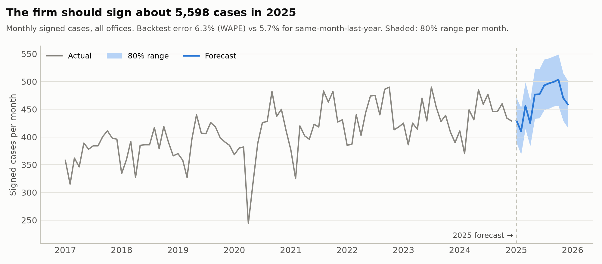
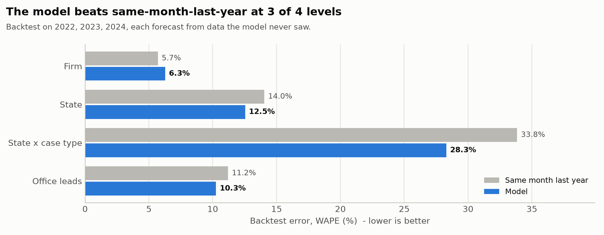

# Forecast Report

*Generated by `notebooks/02_forecast.py`. Signed cases and leads, trained on 2017-2024; backtested on 2022, 2023, 2024, each year forecast only from the years before it. WAPE = total absolute error / total actual.*

## Headline

The firm should sign about **5,598 cases in 2025** (80% range 5,420-5,774), vs 5,297 in 2024 (+5.7%). On years it never saw, the model's firm-level monthly error was **6.3%**, no better than the same-month-last-year method (5.7%). It does not yet beat the simple baseline everywhere, so use it alongside the baseline, not instead of it.

## Accuracy on unseen years

| Level | Series | Model WAPE | Same month last year | Seasonal average | 80% range held | 95% range held |
| --- | ---: | ---: | ---: | ---: | ---: | ---: |
| Firm | 1 | **6.3%** | 5.7% | 8.6% | 75% | 94% |
| State | 6 | **12.5%** | 14.0% | 14.5% | 76% | 93% |
| State x case type | 48 | **28.3%** | 33.8% | 27.7% | 86% | 97% |
| Office leads | 12 | **10.3%** | 11.2% | 13.2% | 83% | 96% |

**Are the ranges honest?** A well-calibrated 80% range should hold about 80% of actual months. It held 75% at firm level, 76% at state level and 86% for segments. The ranges are trustworthy for planning.

**Where the model does not win:** at segment level the simple seasonal average (27.7%) matches or beats the model (28.3%). Small segments carry little trend to learn, so the model's extra terms add noise there. Use the model where it wins, and roll small segments up.

## Forecast by state

| State | 2024 actual | 2025 forecast | Change | 80% range |
| --- | ---: | ---: | ---: | --- |
| Michigan | 723 | 717 | -0.9% | 667-768 |
| Ohio | 712 | 787 | +10.5% | 733-839 |
| Pennsylvania | 694 | 757 | +9.1% | 701-813 |
| Georgia | 733 | 778 | +6.1% | 730-828 |
| Florida | 1,069 | 1,097 | +2.6% | 1,043-1,152 |
| Texas | 1,366 | 1,463 | +7.1% | 1,384-1,546 |

## How much to trust each segment

Small segments are noisy month to month no matter how good the model is: a segment averaging 10 cases a month carries about 25% error from pure chance, even with a perfect forecast (the *noise floor*). So each state x case-type segment is tiered on its **quarterly** backtest error, the grain at which a small case type is planned: **High** (WAPE up to 10%), **Medium** (up to 20%), **Low** (above). 1 segments are High, 12 Medium and 35 Low; High segments carry 10% of forecast volume. Month by month, the model's error is on average 1.19x the noise floor (1.00x = as good as any forecast can be).

| Case type | Michigan | Ohio | Pennsylvania | Georgia | Florida | Texas |
| --- | :---: | :---: | :---: | :---: | :---: | :---: |
| Auto | Medium (11%) | Medium (12%) | Medium (14%) | Medium (12%) | High (9%) | Medium (11%) |
| Commercial truck | Low (31%) | Low (43%) | Low (27%) | Low (38%) | Low (25%) | Low (24%) |
| Dog bite | Low (42%) | Low (54%) | Low (36%) | Low (53%) | Low (40%) | Low (32%) |
| Motorcycle | Low (56%) | Low (56%) | Low (27%) | Low (30%) | Medium (20%) | Low (30%) |
| Pedestrian & bicycle | Low (34%) | Low (28%) | Low (33%) | Low (38%) | Low (27%) | Low (21%) |
| Premises liability | Low (25%) | Low (21%) | Medium (14%) | Medium (17%) | Medium (17%) | Medium (17%) |
| Workers' compensation | Low (26%) | Low (30%) | Medium (18%) | Low (25%) | Low (30%) | Medium (17%) |
| Wrongful death | Low (27%) | Low (39%) | Low (29%) | Low (53%) | Low (33%) | Low (34%) |

*Cells: tier (quarterly WAPE).*

## Intake staffing plan

Intake is staffed to the **80th percentile** of forecast leads (60 leads per specialist a month), so a busier-than-expected month is covered 4 times in 5 without overtime. Firm-wide the plan needs **32 specialists in the quietest month and 39 at peak (Aug)**: a swing of 7 seasonal or shared roles, not permanent hires.

| Office | Quietest month | Specialists | Busiest month | Specialists |
| --- | --- | ---: | --- | ---: |
| Atlanta | Jan | 3 | Mar | 4 |
| Cleveland | Jan | 2 | Jul | 3 |
| Columbus | Jan | 2 | May | 3 |
| Dallas | Feb | 3 | Jan | 4 |
| Detroit | Feb | 2 | Jan | 3 |
| Grand Rapids | Flat all year | 2 | Flat all year | 2 |
| Houston | Jan | 5 | Jul | 6 |
| Miami | Jul | 3 | Jan | 4 |
| Philadelphia | Feb | 2 | Jan | 3 |
| Pittsburgh | Flat all year | 2 | Flat all year | 2 |
| Savannah | Flat all year | 2 | Flat all year | 2 |
| Tampa | Flat all year | 3 | Flat all year | 3 |

## Charts

## Limits

- Calendar-only model: it knows seasonality, trend and COVID, not future marketing changes, new offices or law changes. When those are planned, adjust the forecast explicitly and record the adjustment.
- One-year horizon. Beyond that, trend uncertainty dominates.
- Firm data is simulated on real crash and weather patterns; the method transfers unchanged to real data.
- Annual ranges come from the simulated totals, so they are narrower than adding up monthly ranges: months do not all miss in the same direction.
