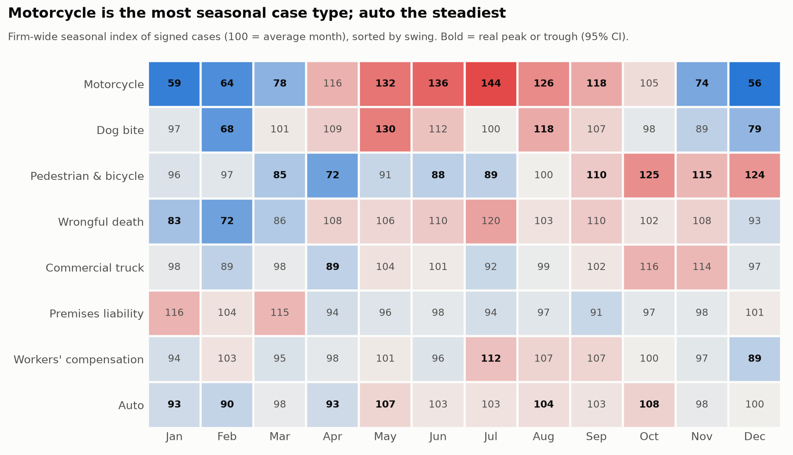
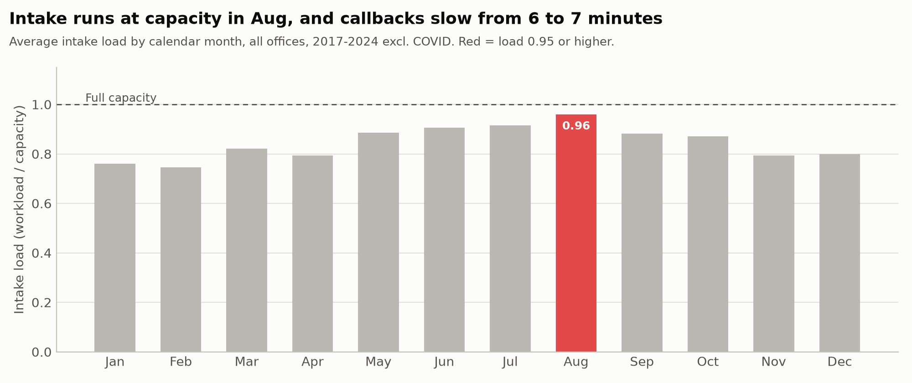

# Seasonality Findings

*Generated by `notebooks/01_seasonality.py` from the BigQuery warehouse. Signed cases, 2017-2024, COVID months (Mar 2020 - Jun 2021) excluded. Index: 100 = an average month. A peak or trough is only called when its 95% confidence interval across years excludes 100. Seasons are the best consecutive 3-month window. Dollar values use the expected fee per signed case (cases signed 2017-2022, lost cases at $0).*

## Headline

Firm-wide intake is seasonal: signed cases run **+7% in Oct** and **-10% in Feb** against an average month. The peak season (Aug-Oct) brings about **63 more signed cases a year** than three average months, worth **$1.1M in expected fees**. Intake is staffed close to flat, so at peak it runs at capacity and loses about $244K a year in fees (finding 7).

## Findings

1. **Seasonality differs sharply by state.** Michigan has the largest swing (43 index points: peak Aug at 122, low Feb at 80); Georgia is the flattest (13 points). One firm-wide staffing calendar would over-staff some offices while under-staffing others in the same month.
2. **Michigan auto runs +19% in Jul-Sep** against an average month (about 31 signed cases in an average month). The season brings about 17 extra cases a year, worth $129K in expected fees.
3. **Pennsylvania auto runs +11% in Jun-Aug** against an average month (about 33 signed cases in an average month). The season brings about 11 extra cases a year, worth $91K in expected fees.
4. **Ohio auto runs +9% in May-Jul** against an average month (about 32 signed cases in an average month). The season brings about 9 extra cases a year, worth $62K in expected fees.
5. **Case types move on different calendars.** Firm-wide, motorcycle is the most seasonal case type (88-point swing) and auto the steadiest (17 points). Marketing creative and intake scripts should rotate with them.
6. **Florida runs opposite to the firm.** Florida peaks Oct-Dec and is quietest Jun-Aug, while the firm as a whole peaks Aug-Oct. Intake staff in that office are least busy exactly when the rest of the firm is busiest: a shared virtual intake team can cover peaks with existing headcount.
7. **Intake reaches capacity in Aug.** Average intake load is 0.96x in that month vs 0.83x otherwise; median callback slows from 6 to 7 minutes, and the share of leads called within 5 minutes falls from 46% to 34%. Comparing each case type with itself (so the summer case mix is not mistaken for an intake problem), busy months sign 28.0% of leads vs 28.8% at normal-month rates: about **10 signed cases and $244K in expected fees a year** left on the table.

## Recommendations

| Decision | Recommendation | Owner | Evidence |
| --- | --- | --- | --- |
| Staffing | Add seasonal or part-time intake capacity 6-8 weeks before each office's busy season; firm-wide, intake reaches capacity in Aug, so hire by early Jun | Director of Operations | Finding 7 |
| Staffing | Set each office's intake calendar from its own state's index, not a firm-wide average | Office managers | Finding 1 |
| Staffing | Pilot a shared virtual intake queue so Florida intake covers overflow from busy offices in Aug-Oct (and the reverse in its own peak) | Director of Operations | Finding 6 |
| Marketing | Shift spend into the 4-6 weeks before each state's peak season; trim in the trough (Dec-Feb firm-wide) | Marketing | Headline, Finding 1 |
| Marketing | Rotate ad creative by case type with its season | Marketing | Findings 2-5 |
| Performance | Judge office intake against its own seasonal expectation, not last month | Director | Seasonal index (`mart.seasonal_index`) |

## Hypotheses tested

| Starting hypothesis | Result | What it means |
| --- | --- | --- |
| Michigan and Ohio auto intake rises in winter (ice) | Not supported: MI/OH auto runs -11% in Dec-Feb; peak seasons are Michigan Jul-Sep, Ohio May-Jul | Demand here is driven by fatal-crash patterns, which peak with summer driving. Winter crashes are more frequent but less often fatal, so fatal-crash data likely understates winter injury demand. Do not staff for a winter auto surge yet; test it with Michigan and Ohio injury-crash data (Phase 2). |
| Seasonality is the same across the firm | Not supported: swings range from 13 to 43 points, and Florida runs opposite | Plan by office, not firm-wide |

## State calendar

| State | Peak season | Trough season | Swing (pts) | Extra signed cases/yr in peak season | Expected fees |
| --- | --- | --- | ---: | ---: | ---: |
| Michigan | Jul-Sep | Feb-Apr | 43 | 31 | $483K |
| Ohio | May-Jul | Dec-Feb | 34 | 19 | $304K |
| Pennsylvania | May-Jul | Jan-Mar | 25 | 17 | $331K |
| Georgia | Sep-Nov | Dec-Feb | 13 | 9 | $202K |
| Florida | Oct-Dec | Jun-Aug | 21 | 13 | $229K |
| Texas | Jul-Sep | Feb-Apr | 21 | 16 | $266K |

## Charts

## Limits

- Firm intake is simulated on top of real NHTSA crash and NOAA weather patterns (see `reports/assumptions.md`). The method transfers to real firm data unchanged; the specific numbers describe the simulated firm.
- Auto, truck, motorcycle, pedestrian and wrongful-death seasonality follows real fatal-crash patterns; premises, dog-bite and workers' comp seasonality is simulated.
- Seven non-COVID years per calendar month: enough to call large, recurring peaks, not small ones. Unbolded cells in the heatmaps are within normal year-to-year variation.
- The busy-month case loss is an association, mix-adjusted but not a controlled experiment. The callback effect itself is validated separately (planted effect S3).
